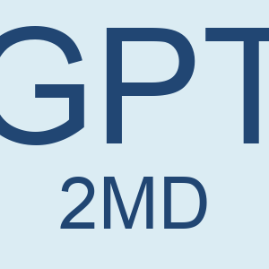

## Draw the icon of this extension

The icon of this extension is drawn from a Python script [`draw_icon.py`](./draw_icon.py) with the help of ChatGPT.

Read the chat transcript [here](./python-script-for-chatgpt-icon.md) to see how I asked ChatGPT to write the script for me.

ChatGPT wrote 4 versions for me, and below are the icons of each version:

**v1:**

**v2:**

**v3:**

**v4** (picked as the icon of this extension):

----------

To run the script on your computer, you'd need to install the [Pillow](https://pillow.readthedocs.io/en/stable/) library.

The [`arial.ttf`](./arial.ttf) file is necessary to run the script. It was downloaded from [here](https://github.com/kavin808/arial.ttf/blob/98cce99ddda56fcf25b3fcb81f923603b84ec68a/arial.ttf).

